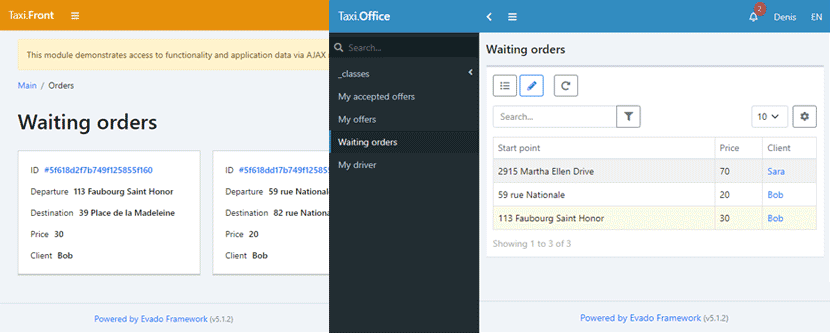

# Taxi Network App

A web application built on [Evado Declarative Framework](https://github.com/mkhorin/evado)
helps users to provide each other with taxi services.

Basic scheme of user-passenger actions:

- register as client;
- create an order with places of departure, destination and desired price;
- accept an offer from an user-driver.

Basic scheme of user-driver actions:

- register as driver;
- create a counter offer to an waiting order;
- obtain client consent;
- confirm and start order execution.

[](https://mkhorin.github.io/evado-site/)

## Docker installation

Clone application to `/app`
```sh
cd /app
docker-compose up -d mongo
docker-compose up --build installer
docker-compose up -d server
```

## Typical installation

#### Install environment
- [Node.js](https://nodejs.org) (version 16)
- [MongoDB](https://www.mongodb.com/download-center/community) (version 4)

#### Linux
Clone application to `/app`
```sh
cd /app
npm install
NODE_ENV=development node console/install
NODE_ENV=development node console/start
```

#### Windows
Clone application to `c:/app`
```sh
cd c:/app
npm install
set NODE_ENV=development
node console/install
node console/start
```

## Usage

Web interface `http://localhost:3000`

Sign in as client:
```sh
Email: b@b.b
Password: 123456

Email: s@s.s
Password: 123456
```
Sign in as driver:
```sh
Email: d@d.d
Password: 123456

Email: t@t.t
Password: 123456
```
Sign in as administrator:
```sh
Email: a@a.a
Password: 123456
```

## Tutorial
- [Build an App Without Coding](https://mkhorin.github.io/evado-site/)